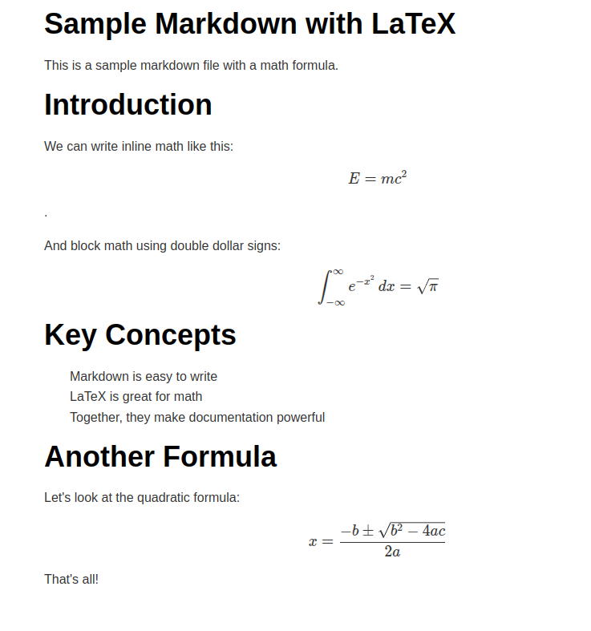

# 📝 md2htmlify

A lightweight Python package to convert Markdown files into beautiful, responsive **HTML** documents—styled with **Tailwind CSS**, **MathJax**, and optimized for clean typography.

> Ideal for offline use, this package is perfect for generating documents in secure environments without internet access.

  
  


---

## 🚀 Features

- ✅ Convert `.md` files into clean **HTML**.
- 🎨 Styled using **Tailwind CSS**  
- 🧮 Built-in **MathJax** support for LaTeX equations  
- 📝 Beautiful, readable typography with Tailwind’s prose class  
- 📦 Works offline — no internet or CDN required  
- 🔄 Support for CLI  

---

## 📦 Installation

Install `md2htmlify` using `pip`:

```bash
pip install md2htmlify
```

---

## 🖼️ Screenshots

> See `test_data/` for example Markdown and the output.



---

## 🧑‍💻 Author

**Deepak Raj**  
[GitHub – codeperfectplus](https://github.com/codeperfectplus)

---

## 🤔 Why `md2htmlify`?

> I built `md2htmlify` to make Markdown publishing easier—especially on systems without internet access. With a built-in offline mode, it's ideal for generating clean documents on secure or offline environments.

---

## 💬 Contributions Welcome!

This is an open-source project. Found a bug or want a feature?  
Feel free to open an issue or pull request.
